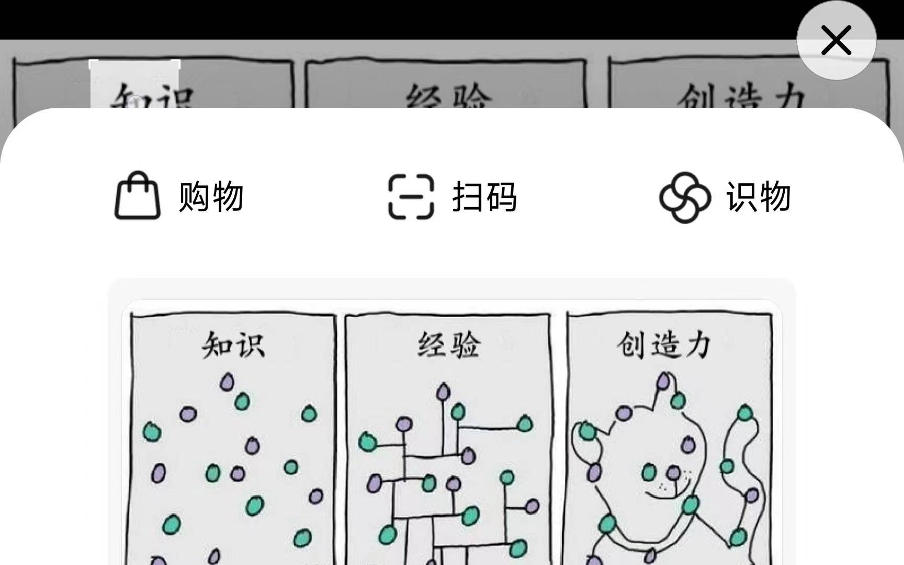

# 横屏传送门

强行在横屏模式下启用miui传送门

# 注:从3.2.x 的传送门开始,小米取消了传送门在横屏下的限制

# 如何使用

1、安装[Magisk](https://github.com/topjohnwu/Magisk)

2、安装[LSPosed](https://github.com/LSPosed/LSPosed)

3、安装[miui传送门](util/传送门_2.5.64.apk)

4、安装此[app](util/app)，并在LSPosed中勾选

5、使用[创建快捷方式](util/创建快捷方式.apk)，启用传送门，确保在竖屏模式下能正常使用

6、重启传送门，横屏，测试能否使用

# 软件原理

通过拦截`com.miui.contentextension.services.TextContentExtensionService`

类中的`isScreenPortrait`方法，使其返回`true`，从而达到横屏使用传送门的目的

# 截图

